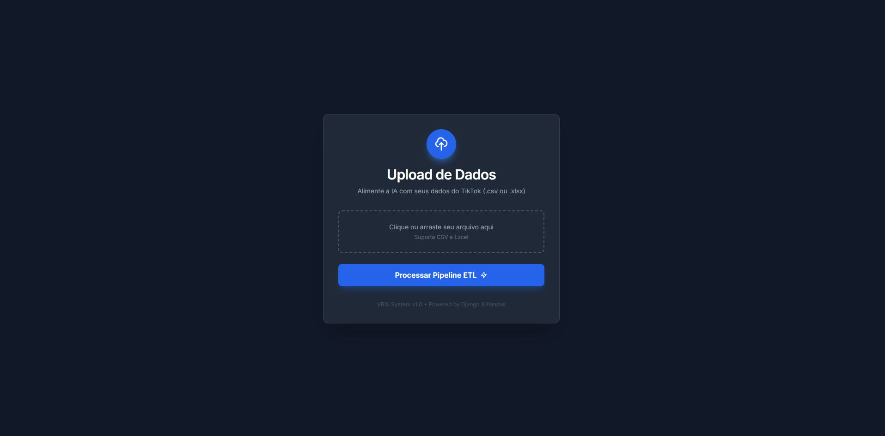

# 📊 Influência de Retenção de Tela Vertical no Comportamento de Consumo

> Projeto desenvolvido como parte do Trabalho de Conclusão de Curso (TCC) em Sistemas de Informação.


*(Nota: Adicione uma imagem na pasta 'docs' com o nome 'preview.png' ou altere o caminho acima)*

## 📝 Sobre o Projeto

Este sistema atua como o backend para a coleta e análise de dados de vídeos em formato vertical (Shorts, Reels, TikTok). O objetivo é correlacionar métricas de retenção visual com o comportamento de consumo do usuário.

A aplicação foi projetada para processar grandes volumes de dados via planilhas (`.xlsx`), realizando a limpeza e estruturação das informações para análise estatística.

## 🛠 Tecnologias Utilizadas

* **Linguagem:** Python 3.12+
* **Framework Web:** Django 5.x
* **Gestão de Dependências:** Poetry
* **Análise de Dados:**
    * **Pandas:** Manipulação e limpeza de dados (DataFrames).
    * **NumPy:** Cálculos numéricos e vetoriais.
    * **OpenPyXL:** Leitura e escrita de arquivos Excel.
* **Front-end:**
    * **HTML5 & Framework CSS: Bootstrap 5 (para componentes responsivos e grid system).**
    * **Django Template Language (DTL)**

## ⚙️ Desafios Técnicos e Soluções

### Tratamento de Inconsistência de Dados (ETL)
Durante o desenvolvimento, implementamos pipelines de tratamento para lidar com inconsistências comuns em dados brutos, especificamente:
* **Conversão de Tipos:** Tratamento de erros de conversão `float/NaN` para `integer` utilizando tipos de dados anuláveis (`Int64`) do Pandas.
* **Sanitização:** Limpeza automática de células vazias ou corrompidas antes da inserção no banco de dados.

## 🚀 Como Executar o Projeto

Siga os passos abaixo para configurar o ambiente de desenvolvimento localmente.

### Pré-requisitos
* Python instalado
* Poetry instalado (`pip install poetry`)

### Instalação

1.  **Clone o repositório:**
    ```bash
    git clone [https://github.com/seu-usuario/nome-do-repo.git](https://github.com/seu-usuario/nome-do-repo.git)
    cd nome-do-repo
    ```

2.  **Instale as dependências:**
    ```bash
    poetry install
    ```

3.  **Ative o ambiente virtual:**
    ```bash
    poetry shell
    ```

4.  **Execute as migrações:**
    ```bash
    python manage.py migrate
    ```

5.  **Inicie o servidor:**
    ```bash
    python manage.py runserver
    ```

O projeto estará rodando em: `http://127.0.0.1:8000/`

## 📂 Estrutura do Projeto

* `core/`: Configurações principais do Django (`settings.py`, `urls.py`).
* `planilhas/`: App responsável pelo upload e processamento dos arquivos Excel.
* `pyproject.toml`: Arquivo de configuração de dependências do Poetry.

---
**Status:** 🚧 Em Desenvolvimento